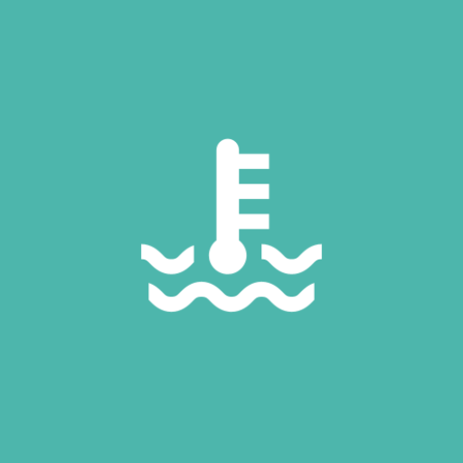
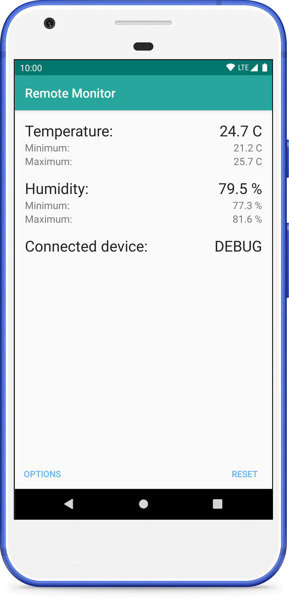
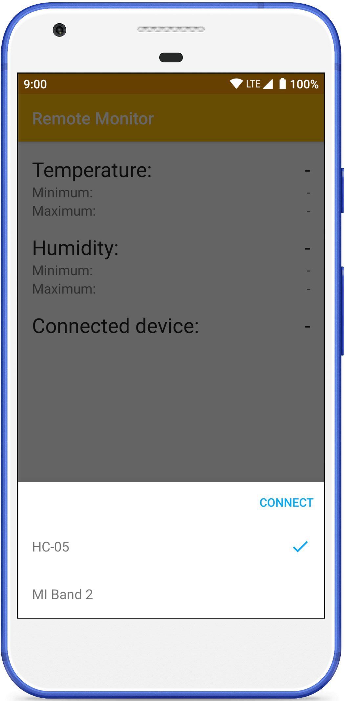

# Android Remote Temperature Control Client

[](https://travis-ci.org/fartem/android-remote-temperature-control-client)
[](https://codebeat.co/projects/github-com-fartem-android-remote-temperature-control-client-master)
[](https://codecov.io/gh/fartem/android-remote-temperature-control-client)
[](https://android-arsenal.com/details/3/7943)

## About

Remote client for [Arduino temperature project](https://github.com/fartem/arduino-temperature-control).

## How to run

__With Arduino module__

1. run [Arduino module](https://github.com/fartem/arduino-temperature-control);
2. pair your Android device and Arduino Bluetooth module from a device settings;
3. install `devicebt` app flavor;
4. run app and select Arduino Bluetooth module from devices list.

__Without Arduino module__

Install `debugbt` app flavor.

## Download


## Screenshots

<br/>
<p align="center">
  
  
</p>

## How to contribute

Read [Commit Convention](https://github.com/fartem/repository-rules/blob/master/commit-convention/COMMIT_CONVENTION.md). Make sure your build is green before you contribute your pull request. Then:

```shell
$ ./gradlew clean
$ ./gradlew build
```

If you don't see any error messages, submit your pull request.

## Contributors

* [@fartem](https://github.com/fartem) as Artem Fomchenkov
