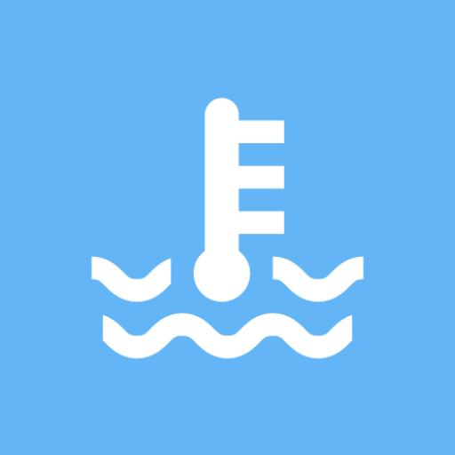

Android Remote Temperature Control Client
=============

[](https://travis-ci.org/fartem/android-remote-temperature-control-client)
[](https://codecov.io/gh/fartem/android-remote-temperature-control-client)
[](https://android-arsenal.com/details/3/7943)
[](https://github.com/fartem/android-remote-temperature-control-client/issues)

About
-------------

Remote client for [Arduino temperature project](https://github.com/fartem/arduino-temperature-control).

Before start
-------------

1. install and run [Arduino module](https://github.com/fartem/arduino-temperature-control);
2. pair your Android device and Arduino Bluetooth module;
3. install and run Android application and select Arduino Bluetooth module from devices list.

Download
-------------


Screenshots
-------------

<br/>
<p align="center">
  
  
</p>

How to contribute
-------------

Read [Commit Convention](https://github.com/fartem/repository-rules/blob/master/commit-convention/COMMIT_CONVENTION.md). Make sure your build is green before you contribute your pull request. Then:

```shell
gradlew clean
gradlew build
```

If you don't see any error messages, submit your pull request.

Contributors
-------------

* [@fartem](https://github.com/fartem) as Artem Fomchenkov