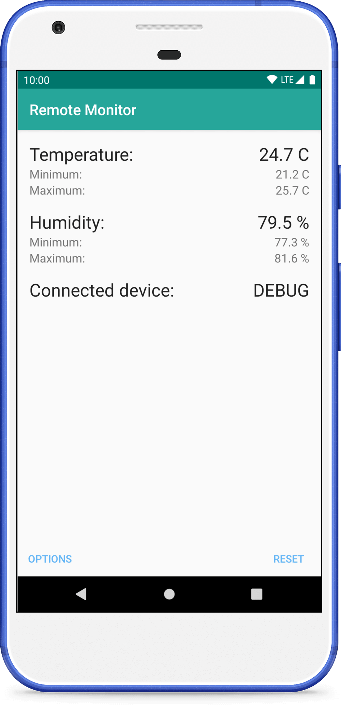

# android-remote-temperature-control-client

Remote client for [Arduino temperature project](https://github.com/fartem/arduino-temperature-control).

## 1. Before install

__How to use this app:__

1. Install and run [Arduino module](https://github.com/fartem/arduino-temperature-control);
2. Pair your Android device and Arduino Bluetooth module;
3. Install and run Android application and select Arduino Bluetooth module from devices list.

## 2. App structure

### 2.1. MonitorBluetoothConnection

Class for control Bluetooth connection and notify about new Arduino Monitor data available.

Required [SignalTarget](https://github.com/fartem/android-remote-temperature-control-client/blob/master/app/src/main/java/com/smlnskgmail/jaman/remotetemperaturecontrol/monitor/entities/signaltype/SignalTarget.kt) to send new raw Arduino Monitor data.

### 2.2. TemperatureDataController

Provider between Monitor connection and [MonitorFragment](https://github.com/fartem/android-remote-temperature-control-client/blob/master/app/src/main/java/com/smlnskgmail/jaman/remotetemperaturecontrol/navigation/fragments/MonitorFragment.kt).

Required [MonitorTarget](https://github.com/fartem/android-remote-temperature-control-client/blob/master/app/src/main/java/com/smlnskgmail/jaman/remotetemperaturecontrol/monitor/MonitorTarget.kt) for send formatted strings to [MonitorFragment](https://github.com/fartem/android-remote-temperature-control-client/blob/master/app/src/main/java/com/smlnskgmail/jaman/remotetemperaturecontrol/navigation/fragments/MonitorFragment.kt).

## 3. Tests

Suite class: `TestSuite`.

| Order | Class | Description | Status |
| --- | --- | --- | --- |
| 1 | MonitorDataExtractorTest | Check parsing result from Arduino | `Pass` |
| 2 | DataSendTest | Validate data sending | `Pass` |

## 4. Screenshots

 

  
  
  
  

## 5. About

Main functionality working and tested on real system (see more [here](https://github.com/fartem/arduino-temperature-control)). May contains some UI bugs.