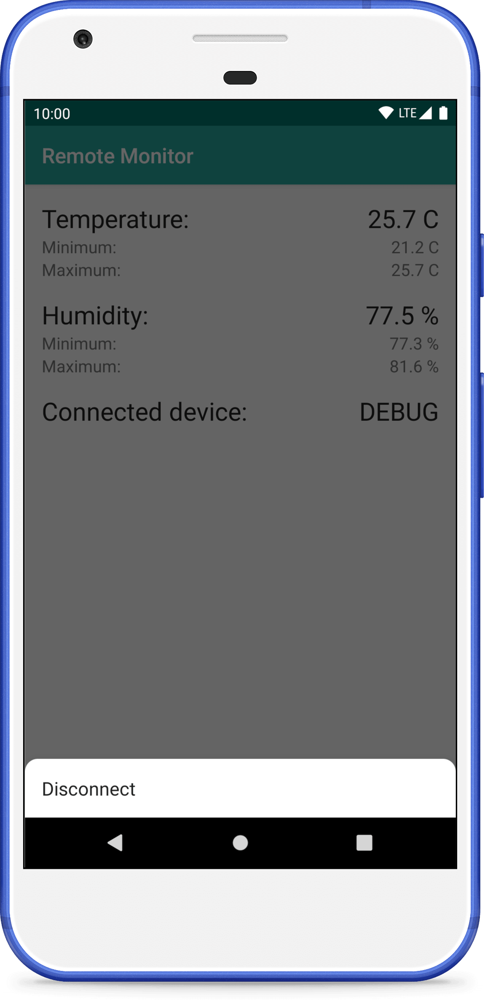

[]

## About

Remote client for [Arduino temperature project](https://github.com/fartem/arduino-temperature-control).
Main functionality working and tested on real system (see more [here](https://github.com/fartem/arduino-temperature-control)). May contains some UI bugs.

## Before start

__How to use this app:__

1. Install and run [Arduino module](https://github.com/fartem/arduino-temperature-control);
2. Pair your Android device and Arduino Bluetooth module;
3. Install and run Android application and select Arduino Bluetooth module from devices list.

## Screenshots

 

  
  
  
  

